# Table of Contents
----
- [**1. Introduction**](#--1-introduction--)
  * [1.1 Overview](#11-overview)
  * [1.2 Business Context](#12-business-context)
  * [1.3 Ethics](#13-ethics)
  * [1.4 Glossary](#14-glossary)
- [**2. General Description**](#--2-general-description--)
  * [2.1 Product / System Functions](#21-product---system-functions)
  * [2.2 User Characteristics and Objectives](#22-user-characteristics-and-objectives)
  * [2.3 Operational Scenarios](#23-operational-scenarios)
  * [2.4 Constraints](#24-constraints)
- [**3. Functional Requirements**](#--3-functional-requirements--)
  * [3.1 User Register](#31-user-register)
  * [3.2 Login](#32-login)
  * [3.3 Resetting Login Password](#33-resetting-login-password)
  * [3.4 Functionality of a User](#34-functionality-of-a-user)
  * [3.5 Functionality of a Graphical User Interface](#35-functionality-of-a-graphical-user-interface)
  * [3.6 Functionality of a Computer Vision Algorithm](#36-functionality-of-a-computer-vision-algorithm)
  * [3.7 External Requirements](#37-external-requirements)
- [**4. System Architecture**](#--4-system-architecture--)
- [**5. High-Level Design**](#--5-high-level-design--)
  * [5.1 Context Diagram](#51-context-diagram)
  * [5.2 Data Flow Diagram](#52-data-flow-diagram)
  * [5.3 Use Case Diagram](#53-use-case-diagram)
- [**6. Preliminary Schedule**](#--6-preliminary-schedule--)
- [**7. Appendices**](#--7-appendices--)

# **1. Introduction**
-------
## 1.1 Overview
The Library Occupancy App will provide students of the DCU Glasnevin campus with up-to-date information about the occupancy levels of all five floors of the main DCU library. A user will simply create an account on the app using their DCU email address and a password which they set themselves. They can then log into the app and select a floor from the menu screen. Upon choosing a floor a detailed heatmap of that floor will appear on their screen, showing the occupancy level of that floor at that very minute. The user is free to go back and check on other floors using the back button on the screen. When they are finished users can simply tap the logout button and they will be logged out. Should the user decide that they no longer want to use the app they can delete their account easily and quickly.

At the best of times it can be difficult to find a quiet spot in the library in which to work and study. During exam time it is nigh on impossible. There is nothing more frustrating than walking or commuting all the way to the DCU campus only to discover that there are no free seats in the library. The DCU Library Occupancy App will provide DCU students with the information they need to decide whether or not it is worth the trouble to make the journey to DCU, or whether they'd be better served to stay and work at home, thus mitigating one of DCU's more annoying problems.

## 1.2 Business Context
DCU is a multi campus university which includes Glasnevin, St.Patrick's All Hallows, and Mater Dei. DCU Library App will be used by students from the Glasnevin Campus. The Glasnevin campus has around 12,000 undergraduate students, over 600 research postgraduates and 1,800 taught postgraduate students. The seating capacity at the Glasnevin Campus is 1,200 seats. If the app was expanded to universities around Ireland then the market for the app would be the universities themselves. The app would be sold to universities looking to provide capacity information to university students in Ireland. However, the app itself is not confined to just university libraries. 

The app could in theory function in any enclosed space that has CCTV cameras and where information about occupancy is sought. Take for example a shopping centre, this app could be used to monitor the occupancy levels of a shopping centre. This information could be used to give potential occupants of retail space better information about footfall in the shopping centre. This is just one example, the app could be expanded into a number of industries and areas.

## 1.3 Ethics
When a system is built that uses sensitive information about people ethics have to be taken into account. Our system uses open source data sets to train the algorithm and doesn't process real images from CCTV cameras. If a real system was built to process CCTV images then those images would have to be handled with extreme care in order to respect the people in the images. The images for the most part would be discarded immediately after they're processed. Those images that would be kept in order to better train the algorithm and improve the system would only be handled by people with the right approval and credentials. In a system like this, the privacy of people involved is of the utmost importance.

----------
## 1.4 Glossary
- AWS - Amazon Web Services

 Amazon Web Services is a suite of scalable and cost effective cloud computing services provided by Amazon.

- EC2 - Elastic Compute Cloud

 Elastic Compute Cloud is a service which allows users to rent cloud servers from Amazon. 
 
- Computer Vision 

 Is the field that deals with giving computers the ability to have a high level understanding when trained with videos and images.

- OpenCV

 OpenCV is an open-source computer vision library.
 
- React Native

 React Native is a framework which allows you to build native mobile applications.
 
 

----------
# **2. General Description**
----------
## 2.1 Product / System Functions
#### User functionality
**Download/Account creation:** A user will download the app and create an account using their DCU email address and a valid password that they have chosen. These details will be encrypted and stored in the user database. We will investigate using the DCU single sign on. If we can implement this, users can have the option of creating their own account or use the single sign on that DCU has already available through Google.

**Login:** A user will login using their email address and password. These details will be validated against the records in the user database.

**Select floor:** A user will select a floor from the list of possibilities. A map with a heat map overlaid with information about the occupancy of the floor as well as a textual description of the occupancy of the floor will be displayed.

**Reset password:** A user who has forgotten their password or a user who wants to change their password will be able to change it. Their new password will be encrypted and the user database will be updated.

**Delete Account:** A user can delete their account should they wish to. The user database will be updated accordingly.

----------
## 2.2 User Characteristics and Objectives

The target audience of the DCU Library Occupancy App will be DCU students. The typical age range of these students is 17-25, although when mature students and postgraduate students are taken into account, the age range becomes more varied. Most of these students could be described as technically literate. However, because most of the complexity of the application is abstracted from the user a high level of technical literacy will not be required in order get the most out of the application.

As previously mentioned, most DCU students fall into the category of 17-25 year olds. They have grown up in the information age and therefore expect up-to-date information on demand. Our app will initially aim to have information accurate to five minutes. Depending on on the algorithm we use and our infrastructure we will aim to decrease this to closer to real-time if time allows it. The more up-to-date and accurate the information in our application is, the more useful the app is and the more appealing it is to DCU students.

Our app will also include a textual description of the heat maps in order to facilitate users who suffer from colour blindness. If we have time at the end of the development of our application we will look to make our application accessible to people who suffer from more severe visual impairment.

The main objective of all of users is to find a library seat as quickly as possible in order to allow them to focus on getting assignments and study done, minimising wasted time in the process.

----------
## 2.3 Operational Scenarios
#### Account Creation:
When the app is first opened, the user may login or create a new account. If the user does not have an account, they must create one. After the user clicks the create account button they will be redirected to the account creation screen. Here they will be asked to provide their DCU email. When the email is entered the user will then create their password. The password they create, must meet the required complexity. If it does not meet these standards, the user will be asked to input a password that meets the required complexity. When the user makes a password that meets the complexity requirements, they will re-enter this password into another text field. Once all the input is entered correctly the user will click the create account button and they will have created their account. They will then be redirected to the login page. 

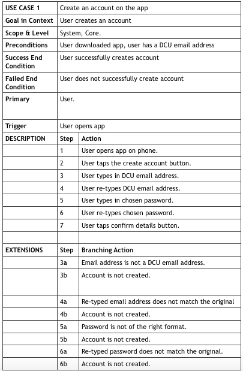

#### Login:
When the user has an account they will be able to login to the app. To do this they will open the app and click the login button. Here they will be redirected to the login page. The user will then be asked to enter their email and password in the correct fields. These details will then be checked in our database. If either field does not match what's in the database, the user will be notified and will have to re-enter their email and password. When the user inputs the correct email and password they will then be redirected to the choose floor screen

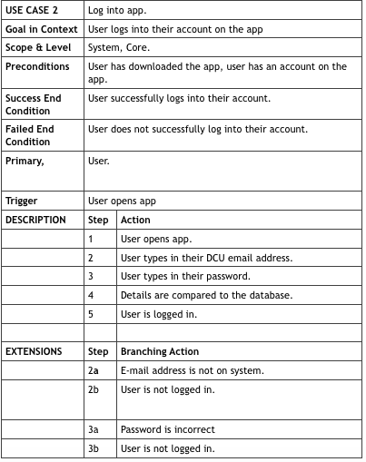

#### Check Occupancy of Floor:
When the user successfully logs into the app they will be redirected to the choose floor screen. Here they will be presented with a list of floors they can choose from. The user will click on the floor that they want and the screen for that floor will appear, displaying the heat map and description of how many occupied the floor is.

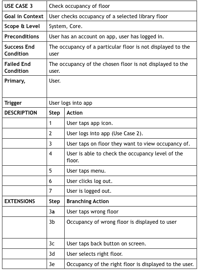

#### Reset Password:
If the user forgets their password, they will be able to change it. When they open the app they will click the "Reset Password" button. This will redirect to the reset password screen. Here they will enter their email address and click the "Send Password Reset Email" button. They email they enter will then be checked, and will notify the user if the email does not belong to an account. The user will then be redirected to the input code screen. At this time they will also receive an email of a 6 digit code. The user will then enter the code into the text field. This code will be verified to ensure safety of users on the app. This user will then move to the change password screen, where the user will enter the same password into the two text fields. When the user clicks the reset password button, the two passwords will be checked that they match the required complexity. The user will have their password reset and will be redirected to the login screen

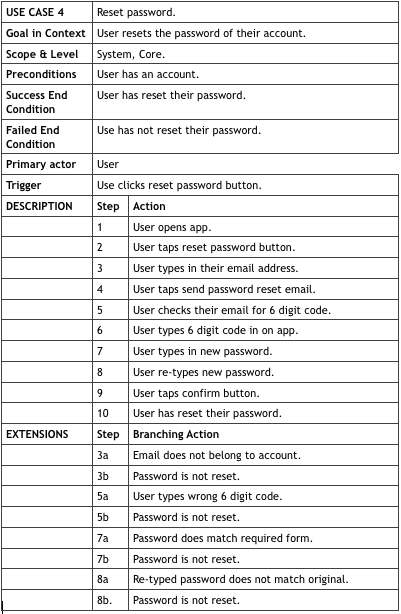
 
#### Delete Account:
If the user decides they do not want to use the app anymore they can delete their account. To do this, they will have to login successfully to the app. Upon completion, the user will click the menu button. They will be redirected to the menu screen. From here the user will click the delete account button. An "Are you sure" message will appear on the screen and the user will click yes. Their account will be deleted, and the user will be redirected to the login screen.

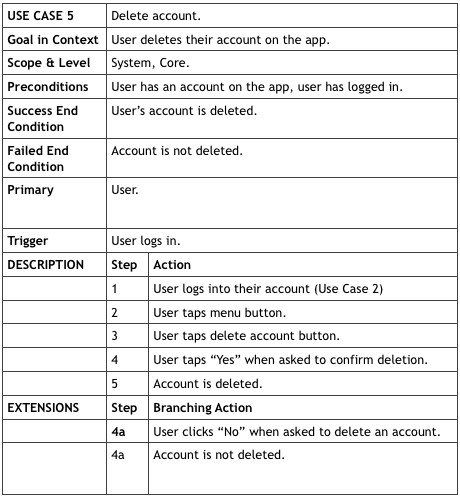

----------
## 2.4 Constraints
**Time** We only have three months to develop the app from design to implementation. In this period we also have six exams and assignments. This all means that we will be heavily constrained time wise when it comes to the project.

**Algorithm** We are going to be using an open source computer vision algorithm to process our images. While current computer vision algorithms are good they are not perfect. Our results will only be as good as the images we provide and the algorithm we use.

**Training Data** The algorithm we are using will be trained using open source datasets. These datasets provide good data, but the amount of data they provide isn't that large. Computer vision relies on large amounts of data, which we will not have, therefore our results may be constrained by training data.

**Experience** We have never developed a project this large and technical in just a pair. We have little experience in many of the areas of our project, e.g. computer vision. While we are actively learning about these areas, three months is a short time to gain experience in these areas.

**Testing** Our project will be a simulation which will make it harder to test it with real users. We will have to workaround this issue and come up with other ways to test the accuracy of our application.

----------

# **3. Functional Requirements**
----------
## 3.1 User Register
 - Description

When registering a user, a user passes their own DCU email address, a password, and a re-entry of the password. These details are linked together in the database, so that they will be able to login in the future using these credentials.

 - Criticality

Once the details are entered, the system must check that it is a valid DCU email address and the password meets the required complexity. These measures ensure that all the accounts are secure. As no person can register twice, no email can be used twice.

- Technical Issues

There are two main issues with this requirement. The first being ensuring that the person has a valid DCU email. The second is that all the credentials of the user that are entered are safely secured in the database. We plan on encrypting all of the credentials, using a bcrypt, password hashing function that adds random characters and scrambles each password. This means that if the database was breached, it would be very difficult to find the original user email and password.

- Dependencies on other requirements

Without users having the ability to register, there would be no system as it require users to login using their credentials. This registration page provides the database with all the necessary account details. The application needs this requirement to function and to provide a resource for the user.

## 3.2 Login
 - Description

A database is needed to store all users email addresses and passwords so that they can log in to the application.

- Criticality

A user being able to login is essential. Without the proper authorization, users will not be able to use the application. They will not be able to check and see which floors in the library are busy. The authorization of DCU students only is important to keep it secure within DCU

- Technical Issues

The main issue we envisage is making sure that the user emails and password are stored safely in the database. We also need to make sure that all login details are unique to each user, and all of the users details should map to the login credentials.

- Dependencies with other requirements

As login is the only point of entry to the system, the user will not be able to access the application without a successful login.

## 3.3 Resetting Login Password

- Description

If a user forgets their password to the application they can reset this password. They can do this by clicking a forgot your password button. Once clicked they will enter their email. When the email is verified to have an account they will be sent an email with a link which will allow them to reset their password

- Criticality

It is important that a user can reset a password. This is because it is very easy to forget a password, and not being able an application due to this would reduce the user experience.

- Technical Issues

The main issue we can see with this functionality is removing the old password and then adding the new one while keeping all of the other credentials of the user. The main problem we see with this is making sure that the new password will be safely stored in the database.

- Dependencies on other requirements

The user must have an account to reset the password. As the login is the only point of entry to the application, they will not have access to the application without a logging in successfully.

## 3.4 Functionality of a User
 - Description

When a user gains access to the application, they can see if a floor in the library is free at that time, via a heat map of the floor plans . They can choose any floor. 

 - Criticality

It is important that the user is able to access the heat map of the floor they have chosen. The main functionality of the application is that the user can check and see if the library is busy or not, hence the importance of this.

- Technical Issues

Technical issues may arise in loading the heat map onto the screen from the server. This is because images must be processed first and then through our computer vision algorithm deciphered into how busy a certain area is. Once this is complete the image must be translated into a heat map and then the heat map pushed onto the screen via the server. Due to the complexity of the image processing, technical issues may arise here.

- Dependencies with other requirements

This relies heavily on our computer vision algorithm. If this algorithm is inaccurate it will give the wrong data to the user reducing their ability to use the application

## 3.5 Functionality of a Graphical User Interface

- Description

The graphical user interface must be appealing, in order to attract users to the application. It must be easy to navigate through the application. The application should be accessible to those with disabilities

- Criticality

It is essential that a user can easily navigate through the application, leading to a good user experience. This will also help the user usability of the application.

- Technical Issues

Making the application accessible to all users, in particular blind people, will be challenging. As our application will produce a heat map, a blind user is not able to process this. To cater for this we plan on also having a piece of text describing the areas in the map that are busy and not busy.

- Dependencies with other requirements

Logging in and using the application should be easy and engaging.

## 3.6 Functionality of a Computer Vision Algorithm

- Description

We will be using an open source computer vision algorithm from the OpenCV library to generate the heat maps that will be displayed to the users.

- Criticality

It is essential that we use a good computer vision algorithm, which must be trained with good data in order to provide accurate results. If the results aren't accurate enough, the app becomes less useful. This function is probably the most critical in our application.

- Technical Issues

The main technical issue with the computer vision algorithm is training it sufficiently well to provide accurate results. This issue can be resolved by training the algorithm with good data. We will be training our algorithm with two data sets of data in order to give it the best chance of producing positive results. On top of this, it is important that the algorithm processes the data every five minutes in a worst case scenario. Should time allow it, we will try to make the algorithm process data more regularly than every five minutes. The more regularly the algorithm can process data, the more up-to-date the information in the application is and the more valuable the application is.

- Dependencies with other requirements

The computer vision algorithm generates heat maps which depend on the graphical user interface of our application.
## 3.7 External Requirements
### Hardware
In a real implementation of our system access would have to be given to a CCTV system in order for the algorithm to be able to process the cameras' images and generate heat maps. Users will need a smartphone in order to be able to run the application.

### Software
A user needs to be running the Android operating system in order to be able use the application. The computer vision algorithm would have to be integrated into the CCTV system in order for the images to be processed.

### Environment
A user will need a wifi connection in order to use the app. On campus DCU provides access to Eduroam which provides wifi to DCU students and employees. Off campus a user would need access to another wifi connection, whether it's in their home or elsewhere.

----------
# **4. System Architecture**

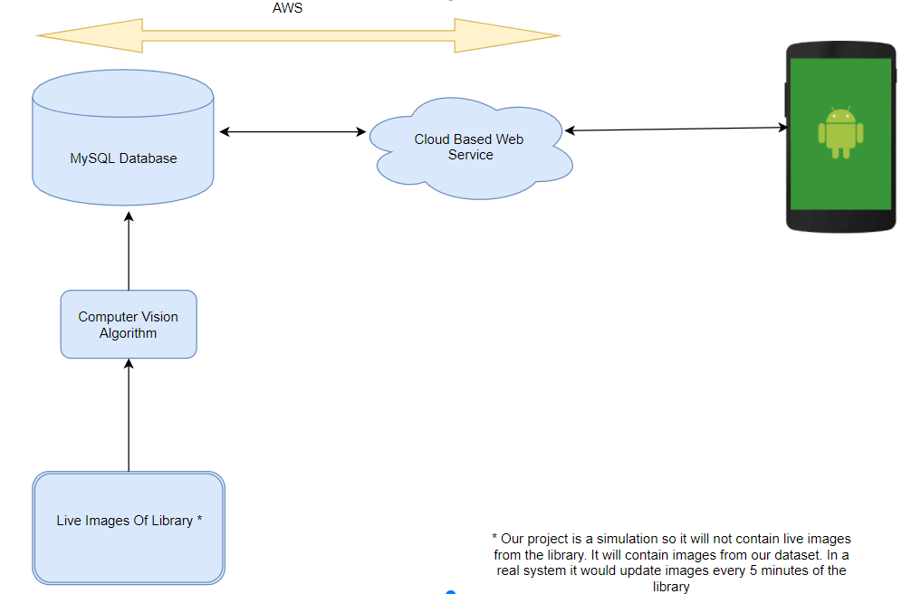
----------
# **5. High-Level Design**

----------

## 5.1 Context Diagram

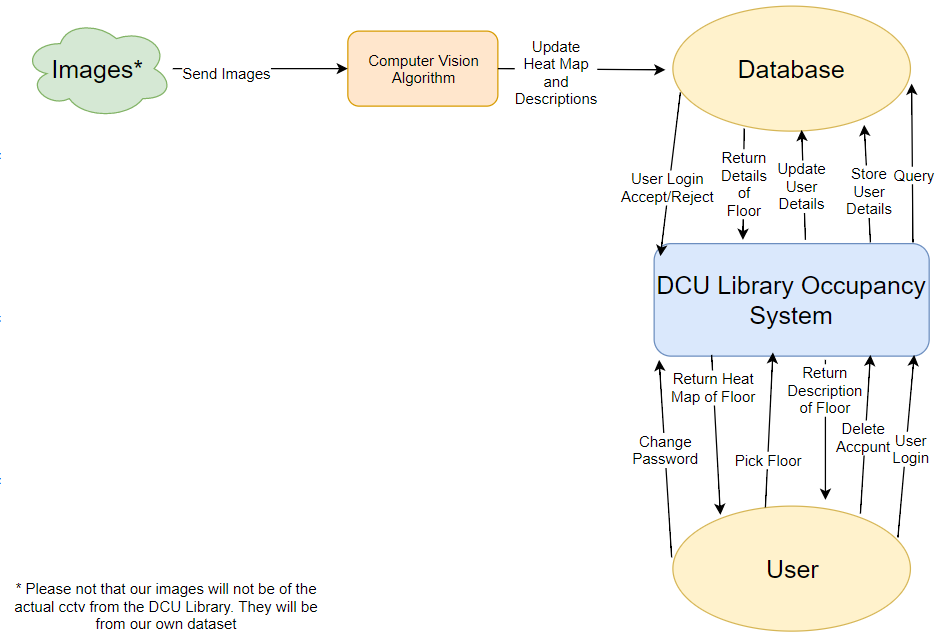
----------
## 5.2 Data Flow Diagram
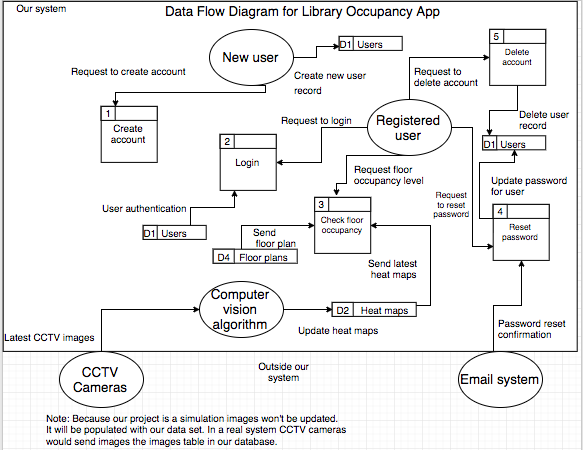

----------
## 5.3 Use Case Diagram

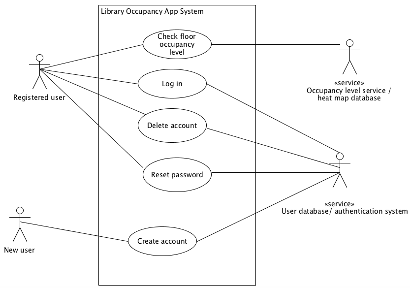

----------
## **6. Preliminary Schedule**

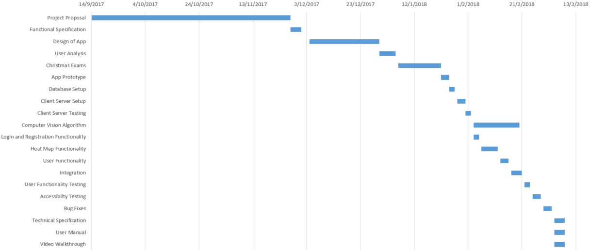
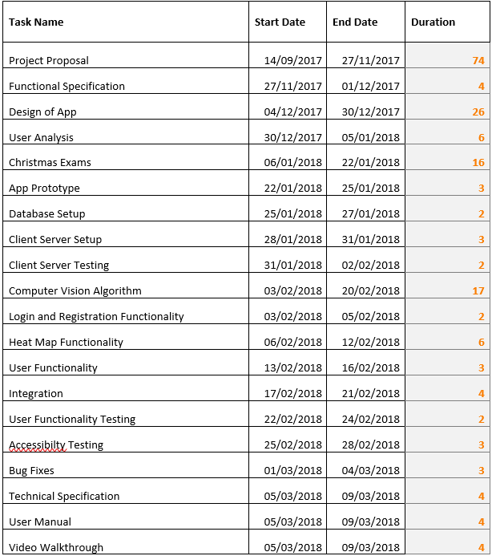

----------
## **7. Appendices**
[AWS home page] (https://aws.amazon.com/ "AWS home page")

[OpenCV home page] (https://opencv.org/ "OpenCV home page")

[React Native home page] (https://facebook.github.io/react-native/docs/getting-started.html#content "React Native home page")

[Piropo data set] (https://sites.google.com/site/piropodatabase "Piropo data set")

[HDA person data set] (http://vislab.isr.ist.utl.pt/hda-dataset "HDA person data set")
