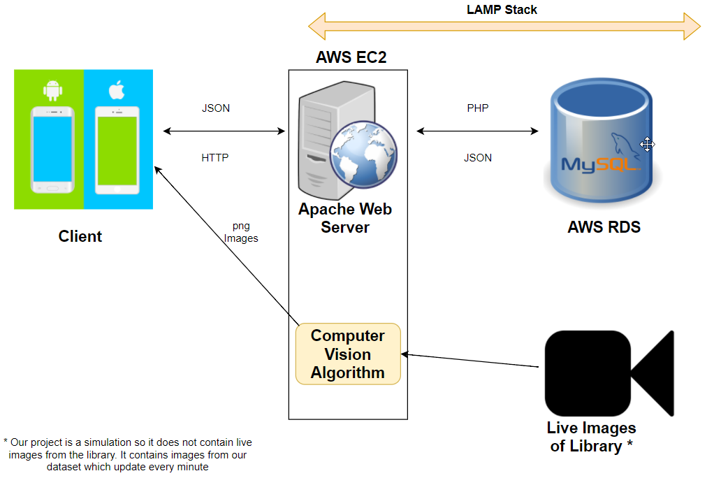

# Technical Specification #

Edward Meade and Gavin McQuaid

# Table of Contents #
- [**1. Introduction**](#--1-introduction--)
  * [1.1 Overview](#11-overview)
  * [1.2 Glossary](#12-glossary)
- [**2. System Architecture**](#--2-system-architecture--)
      - [Client](#client)
      - [Web Server](#web-server)
      - [Database](#database)
      - [Computer Vision Algorithm](#computer-vision-algorithm)
- [**3. High-Level Design**](#--3-high-level-design--)
      - [Context Diagram](#context-diagram)
      - [Data Flow Diagram](#data-flow-diagram)
      - [Component Diagram](#component-diagram)
      - [MySQL Database Dictionaries](#mysql-database-dictionaries)
      - [Class Diagram](#class-diagram)
- [**4. Problems and Resolutions**](#--4-problems-and-resolutions--)
- [**5. Installation Guide**](#--5-installation-guide--)

# **1. Introduction** #

## 1.1 Overview ##

The DCU Library Occupancy application is an Android and iOS mobile application built for student of Dublin City University (DCU), who want up-to-date information about all of the four floors in the DCU Library. Many students require a quiet open area so that they can study to the best of their ability. This application allows every student to make an informed decision, on if it is worth going to the library based on how busy it is and their study requirements. Students must register with their DCU email and provide a password to avail of this application. Once they have completed registration, they can check if the library is busy or not at any given time. They also have the option of logging out of their account, or if they really want to deleting their account entirely. Our hope for this application is that it will be used by DCU students and help them with their studies.

The front end of the application is written in React-Native, a Javascript based framework for mobile application development. The backend mainly uses OpenCV, a framework for image proccessing and Python. To combine these together we use the Lamp Stack which consists of an Apache web server, a PHP server,  a MySQL database, and a Linux Operating System. 

## 1.2 Glossary ##

- PHP - HyperText Preprocessor

  Server side scripting language

- JSON

  Javascript Object Notation, Data interchange format

- React-Native

  A Javascript framework for Mobile Application development
 
- AWS - Amazon Web Services

 Amazon Web Services is a suite of scalable and cost effective cloud computing services provided by Amazon.

- EC2 - Elastic Compute Cloud

 Elastic Compute Cloud is a service which allows users to rent cloud servers from Amazon. 
 
- Computer Vision 

 Is the field that deals with giving computers the ability to have a high level understanding when trained with videos and images.

- RDS - Relational Database Service

 Amazon Relational Database Service (Amazon RDS) makes it easy to set up, operate, and scale a relational database in the cloud.

- OpenCV

 OpenCV is an open-source computer vision library.

# **2. System Architecture** #

The system architecture for the DCU Library Application has stayed mostly the same as what we described months ago in the functional specification. It is a cloud based computing platform. The platform uses a LAMP stack which consists of :

- Linux Operating System
- Apache Web Server
- mySQL Database
- PHP Scripts

#### Client ####
The client is a React Native application running on the end user's smartphone. The reason why we chose React Native as this framework allows us to run the application on both iOS and Android devices.  The actual device does not matter as the underlying framework remains the same.

#### Web Server ####
The client communicates with our Apache Web Server via HTTP requests using the Fetch API. Each request is sent in a RESTful manner to our Apache Web Server which is running on our Amazon Web Services (AWS) EC2 instance. Included in the request is an endpoint. Each endpoint corresponds to a PHP script on our server. A script handles a request and sends a response back to the front-end in the form of JSON.

#### Database ####
We decided to use a MySQL Database to store the user data. We used this as we were familiar with this software from our module in second year where we learned basic SQL syntax. Our database is running on a an Amazon Web Services (AWS) RDS instance. This database is connected to by our Apache Web Server. Our DcuLibApp database has four tables. The data dictionaries of these tables are shown further on in this manual.

#### Encryption ####
We used Message Digest 5 (MD5) to encrypt the passwords of our users before storing the encrypted hexadecimal string in our database. The MD5 algorithm hashes a given string to a 32 character long hexadecimal string. We felt this encryption technique was appropriately strong for our project.

#### Computer Vision Algorithm ####
Our computer vision algorithm uses OpenCV and Python to process the images. We attempted two versions of processing to see which would give us better results. These algorithms are detailed below.  

**Background subtraction:** The first technique we tried was background subtraction. What this technique does is try and extract the moving foreground from the static background of the image. So, for example the training image would be an empty library area. Then the processed image would the same area except with people in it. What the algorithm would basiscally do is look at the two images and see what pixels have changed. 

In a perfect world, all that has changed is the areas where people are standing. The resulting processed image should simply show the outlines of the people in that area. Since this isn't a perfect world there are some problems with this technique. If the lighting in the image changes this can be picked up and affect the quality of the results. We tried to mitigate these problems in two ways. First, we used a function to try and remove some of the noise from an image. Second, we trained our algorithm with images of of empty areas in various states of illumination. This didn't fully solve the problem. 

If we had to actually build the application with footage from the library we'd try and make the data ourselves. Although this would be quite a tedious process we feel it would greatly improve our results. In our experience with machine learning, the algorithm is only as good as the data you feed it.

Below you can see our results.

**Original image:**  

**Heat map generated after processing image:**  

As you can see there's still quite a bit of noise in the photo. The only way to combat this is more data. If we had thousands of images with which to train our algorithm our results would undoubtedly be better. The image above was processed using a subtractor that was trained using only ~250 images.

**People detection:**

After we'd finished with background subtraction we still had some time left so we decided we would try a second machine learning technique. We used the built-in OpenCV people detector. This detector uses the histogram of oriented gradients technique to detect various objects in images. This technique starts by breaking the image down into smaller sub images. For each sub image it then creates a histogram of the edge orientations for the sub image. Then the histograms of all the sub images are combined and used as the feature vector which describes the shape of objects in an image.

Because for this technique we used a built-in people detector we didn't have to train the algorithm ourselves. We had mixed results with this technique. This algorithm was trained with images of people at eye-level view rather than CCTV images. This meant that for some images the algorithm was detecting non-people as people. For example, in one particular image a coat rack with a coat was classified as a person. We tried to change the orientation of the images and make them smaller/larger to try and combat this problem. This resulted in overfitting. We optimised for particular images to the detriment of the overall accuracy of the algorithm. In the end, we left the images as the originally we as it gave us the best results.  

**Original image when it works:**  

**After when it works:**  

**Original image when it doesn't work:**  

**After when it doesn't work:**  

As you can see the results are mixed. In the first example there are no people in the image and no people are detected. While in the second image there are no people yet three are detected due to the shape of the chairs and coat rack.

**Going forward:**  

If we had more time we would pursue the people detection algorithm but we would train it ourselves. This would mean getting people of various sizes, genders, skin colours, etc to help us by appearing in training images for us. We would then have to manually identify all the people in these images before feeding all this data to our algorithm as training data. This would be an incredibly time consuming process, though we feel it would be necessary to get the level of accuracy you'd need for a real product.

# **3. High-Level Design** #

#### Context Diagram ####
The diagram below gives a high level view of our system, and it shows how it interacts with all entities. We have completed all the large functionality tasks that we had planned to do in the beginning based on our functional specification. This diagram shows that.

#### Data Flow Diagram ####
The data flow diagram gives a more low level version of the context diagram. It gives you the opportunity to follow the data flow from the beginning to the end. The data flow begins with the user registration and end with the user deleting their account.

#### Component Diagram ####
The component diagram describes how components of a system interact with one another. In our system you can see that the React Native application interacts with the registration and the login component and the view heat map component. These components interact with the AWS EC2 server which contains many different components like the people detection component. Finally the AWS EC2 server interacts with the MySQL database.

#### MySQL Database Dictionaries ####

**Users table**  
  
  

**Password reset requests table**  
   
  

**Account authentication table**  
  
  

**Textual description tables**  
  
  

#### Class Diagram ####
Class diagrams describe the relationships and dependencies among all of the classes in a piece of software. We have 4 classes, User, Server, Database Accessor and finally Image. From the diagram you can see how each of these classes interact with each other.

# **4. Problems and Resolutions** #

**Problem:** We were unable to get permission to use footage from the library CCTV cameras to feed to our algorithm.
    
**Solution:** We spent time researching open source data sets that looked at detecting the presence of people on CCTV cameras covering indoor spaces that could substitute for the library CCTV cameras. After comparing the data sets we decided that the best one to go with would be the Piropo Database. This data set contains a lot of data and covers rooms that could pass as a library area.

**Problem:** A heat map in our app would have to give a bird's eye view of a library area while every CCTV image in the data set is from an angled perspective.

**Solution:** To solve this problem we had to write a Python function which takes in an image and performs some clever manipulation using the OpenCV library to convert it to a more bird's eye view. Although the results were never going to be perfect we're happy enough with what we achieved.

**Problem:** We had issues updating the heat map images on our front-end.

**Solution:** React Native works on the idea of state. On our server the image would be updated but the path to the image would remain the same. From the front-end's perspective it appears we're trying to perform the costly operation of reloading the same image to our front-end. It just saw that the URI for the image was the same and assumed that the pixels of the image were the same as they were initially so it wouldn't reload it. Our solution to this problem was to add the date to the end of the URI as a paremeter. Even though the date parameter was never used for anything the URI we were requesting now appeared different to the front-end as the date had now changed. The image of the heat map would now reload with the updated data.

**Problem:** Our AWS EC2 instance didn't have enough RAM to run OpenCV and therefore we were unable to run our Python scripts on the server.

**Solution:** To upgrade our EC2 instance to a version with enough RAM would've cost quite a bit of money. Instead, we decided that we would just run our scripts locally and SCP our updated heat maps to our EC2 instance. We feel that this is an ok solution for our presentation and will simply state that in production  a server with the requisite amount of RAM would be paid for and used.

**Problem:** We had issues displaying the dropdown menu for our log out and delete account options.

**Solution:** We tried to use an outside module to provide us with the desired functionality for our dropdown menu. When we integrated it into our app it didn't work that well and wasn't to the standard we had hoped it would be. We decided it would be better if we simply had a settings button which took you to a new page where the log out and delete account options would display. When we coded it up it was a lot cleaner and more reliable than the drop down menu even though it meant we had to add an extra page to our app.

**Problem:** We encountered problems testing our front-end due to buggy testing frameworks and a lack of documentation. 

**Solution:** To unit test our front-end we decided to use Jest. The framework caused us a lot of grief when we tried to integrate it with the XDE we were using, Expo. We encountered many bugs and were forced to install many external modules. Fixing these issues was a matter of trial and error until we found a formula that worked well for us. 

Integration testing our front-end was even more difficult. We settled upon the nascent integration testing framework for React Native, Cavy. There's not much more documentation on Cavy than what's provided on the project's Github page. On top of this issue we were forced to restructure the whole file hierarchy of our project and rewrite some of code in order to be able to actually use the framework. Even when we did all this we realised that because the framework is so new it doesn't integrate with all components of React Native. In the end we had to manually test some aspects of our project.

# **5. Installation Guide** #

**Required Software:**

- Expo IDE 

[https://docs.expo.io/versions/latest/introduction/installation.html](https://docs.expo.io/versions/latest/introduction/installation.html)

- Node version 6 or up:
- npm version 4.6.1

[https://nodejs.org/en/download/](https://nodejs.org/en/download/)

- React Native

[https://facebook.github.io/react-native/docs/getting-started.html](https://facebook.github.io/react-native/docs/getting-started.html)

**Instructions for running the front-end of the application:**

- Choose the location on you computer where you wish to clone the gitlab project, and create a folder in this location

- Open the git terminal window inside the location the folder

- Execute the command : "git clone https://gitlab.computing.dcu.ie/mcquaig7/2018-CA326-gmcquaid-DCULibraryApp.git"

- For Windows open the command prompt and move to C:\Users\"User"\"Your folder location"\2018-ca326-gmcquaid-DCULibraryApp\code\App

- For macOS oepn the command line and move to /Users/"User"/"Your Folder Location"/2018-ca326-gmcquaid-DCULibraryApp/code/App

- Once here run the command npm install to install node modules.

- Open Expo IDE

- Choose "Open Existing Project"

- For Windows Users Select: C:\Users\"User"\"Your folder location"\2018-ca326-gmcquaid-DCULibraryApp\code\App

- For macOS Users Select: /Users/"User"/"Your Folder Location"/2018-ca326-gmcquaid-DCULibraryApp/code/App

- Once the packager loads and the tunnel is connected click the share button

- This should produce a bar code. Download the Expo app on your phone and scan the bar code. Make sure that your phone and laptop are on the same network

- The app should load and you can now use the DCU Library App

**Instructions for running the front-end of the application:**

- You'll need to have MySQL, PHP and an Apache Web Server installed on your machine.  
  
- Start by creating a a database called DcuLibApp on your machine.  

- Create the four necessary tables for this database as specified earlier on in the data dictionaries section fo this technical manual. 

- Move the contents of the php folder except for the dbinfo.inc.sample in the project directory to the /var/www/html directory of your local Apache Web Server.

- Move the dbinfo.inc.sample file from the php folder to the var/www/inc directory of your local web server.

- Remove the .sample extension from this file so it is now called dbinfo.inc. 

- Open the dbinfo.inc file in a text editor and change the credentials to match your own credentials.

- Open every .js file in the App folder of the project and change of instance of http://ec2-34-244-240-250.eu-west-1.compute.amazonaws.com to localhost.

- E.g. http://ec2-34-244-240-250.eu-west-1.compute.amazonaws.com/CreateAccount.php would become localhost/CreateAccount.php 

- In the MachineLearning folder of the project directory remove the .sample extension from databaseconfig.py.sample so that it is now called databaseconfig.py  

- Open the databaseconfig.py file and change to credentials to match your own.  

- You'll need to install Python 3.6, OpenCV3.0, SciPy and NumPy. 

- Dowload the zip folder of our training data from [here.]( https://drive.google.com/open?id=1m5Vk47b9xABDJ8WSVztb3b43-y0wTkYI)

- Move the zip folder of the training data to the MachineLearning directory of the project and unzip it.  

- In the people\_detection.py and background\_subtraction.py files change the lines about scp to point to your localhost.  

- Start up the front-end as specified above. 

- Type either python3 background\_subtraction.py or python3 people\_detection.py  while in the MachineLearning directory to run the machine learning aspect of our project.  

