# Testing Document #

Edward Meade and Gavin McQuaid

------
# Table of Contents ##
- [**1. Validation**](#--1-validation--)
- [**2. Unit Testing**](#--2-unit-testing--)
- [**3. Integration Testing**](#--3-integration-testing--)
- [**4. Manual Testing**](#--4-manual-testing--)
- [**5. User Testing**](#--5-user-testing--)
- [**6. Heuristic Evaluation**](#--6-heuristic-evaluation--)

# **1. Validation** 

Validation on the front-end of our app is carried out on two pages, the create account page and the reset password page. This is done through asynchronous validation functions. We have three such functions: ValidateEmail(), ValidatePassword() and PasswordsMatch(). The ValidateEmail() function uses a regular expression to check that the email currently entered into the email field is a DCU email address. The ValidatePassword() function checks that the password entered is at least eight characters long. Finally the PasswordsMatch() function is used to check the password confirmation field and the password field contain the same input.

Each of these functions is called any time a change is made to their respective form field. They are called together when the create account button is tapped to carry out a final check. If a form field's requirements aren't met a textual message is shown below it describing the field's requirements as shown below. 

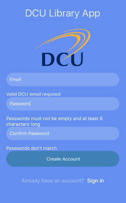 

These messages disappear as soon as a field's requirements are met. 

We understand that client-side validation is insufficient in itself. Our solution is to carry out these checks a final time in our PHP server-side scripts. This gives us better confidence that our validation isn't easy to circumvent.
 

# **2. Unit Testing** 
-----
Unit testing focuses on each individual component of a piece of software, making sure that each component performs the function intended. 

### Jest Unit Testing ###
For our unit testing of our application we used Jest, a unit testing platform associated with React Native applications. The main advantage of Jest is the use of snapshots. This is where a snapshot is taken of your code, giving detailed information about every component. When you change your code and test it again, Jest will tell you about the changes to the snapshot and if you want to add these changes or not. This allowed us to be more efficient in our testing and keep track of any changes we had made. However Jest is not good for test driven development. This meant that we had to think of a new way of thinking for the testing part of this project. It also meant that we did in fact have failing tests. Due to the idea of snapshots, if this was the case, the whole test suite would fail. This meant for our final version of the unit tests, we have passing test cases. The main problem we had with testing was with Jest mainly because it is a new piece of software, and due to this Jest does have some bugs.

Testing each unit/component of our app proved to have a lot of repeated tests. The first thing we tested in each page was that every item that was meant to be rendered, did in fact render. For example, with the login page, we tested that both of the text inputs, the two buttons, the touchable text, the DCU logo and the title of the page all rendered, which they did. Then we had to test the functionality of each page. This meant testing firstly if you could click every button and touchable text, and making sure that you could enter details. Then we would combine these tests and see if the app would perform the required action. For example with the login page, if you entered the correct details and pressed the login button would you move to the menu page. We tested every page of our application in this manner. Below you can see that we ran 60 unit tests in total, capturing 24 snapshots passing all 10 of our test suites. 

All of the tests can be found in the *'code/App/__ tests__'*  

Unit tests can be run by moving into the App directory of the project and typing in "npm test".  

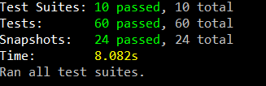

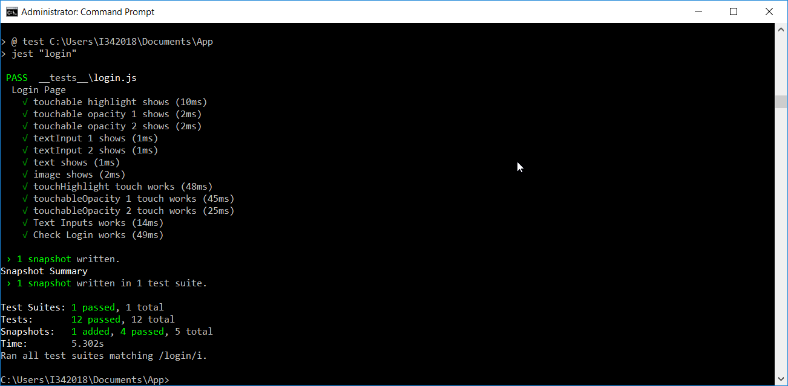

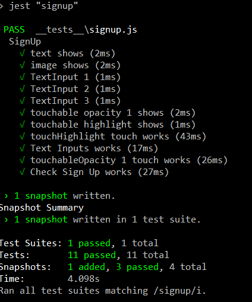 

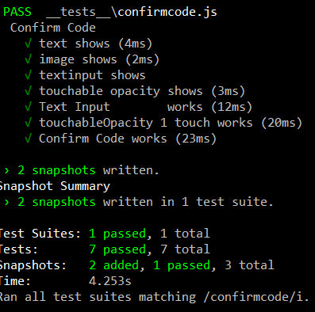
 

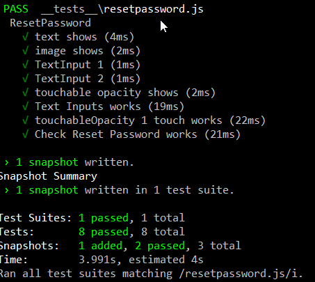

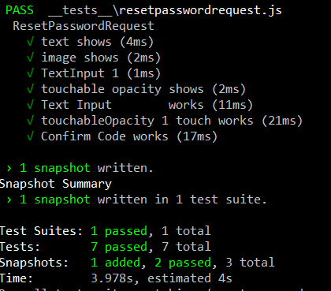

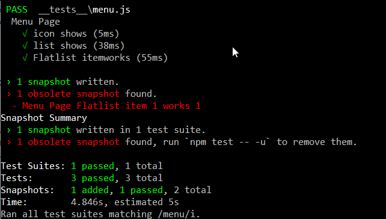

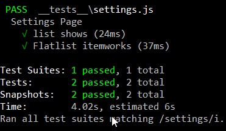

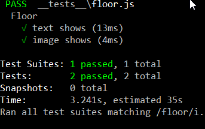

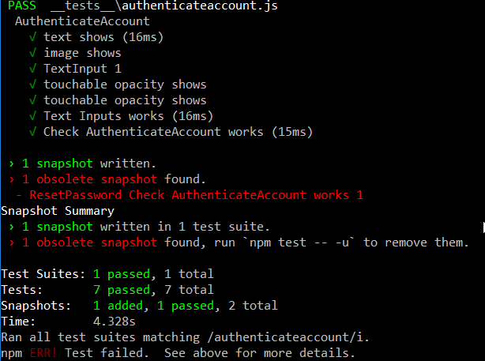

### Python Unit Testing 

We also performed some unit testing on our Python scripts for the the machine learning aspect of this project. These tests simply checked whether the return values of all of the functions used in our machine learning scripts were what we expected them to be. All in all there were nine of these unit tests. We used the PyUnit unit testing framework to carry out these tests.  
   
In the common.py file we tested the transform function and the heat\_map\_floor functions. The heat\_map\_floor function was tested with both versions of the generate\_description function.  

In the background\_subtraction.py script we tested the denoise, train\_subtractor, background\_subtraction, and generate\_description functions.    

Finally in the people\_detection.py file we tested the people\_detection and generate\_description functions.  

To run these tests simply navigate to the code/MachineLearning/tests folder and type python3 test.py  

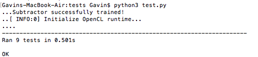

# **3. Integration Testing**
-----

For our integration testing we used a framework called Cavy. This is a very new framework developed for React Native applications. It is designed for end-to-end testing, which means that it tests your application from start to finish. However like Jest it is not great for test driven development, but end to end testing allows you to test every possible transition in the application. This allows us to truly test how each component interacts with each other which is definition of integration testing. Unfortunately, Cavy doesn't integrate well with some of our components. What this has meant in practice is that we had to manually perform tests for our delete account and log out functions. However, for the rest of our functionality we were able to utilise Cavy for testing. 

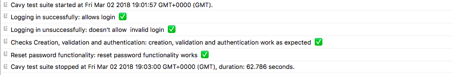  

[You can see our integration tests running here](https://www.youtube.com/watch?v=Qr3Wc-se8Hk&t=4s)

**Logging in successfully**  
This test simply ensures that a user with the right credentials can log into our system.

**Logging in unsuccessfully**  
This test ensures that a user with the invalid credentials can't log into our system.

**Checks creation, validation and authentication**   
This test checks our create account, validation and authentication features all work. First it will try and create an account with an invalid email. Then it tries with an already taken email address. After this it tries with a password of invalid length. Next it tries with a password that doesn't match its confirmation field. All of these attempts should fail. Finally it should successfully create an account with valid credentials.

The test then uses these credentials to log in successfully. Because it is the first time this account has been used it needs to be authenticated. First an invalid code is used to attempt authentication. This should fail at which point a new code is generated by tapping the generate new code button. The test now tries with the new valid code and should be able to successfully authenticate the new account. 

**Reset password**  
This test ensures that a user can reset their password. The test begins by checking you can navigate to the reset password request page. It then tries to reset the password of an account with an invalid email. This should fail. It then enters a valid email. Then test then attempts an invalid reset code. This will fail. It then uses a valid code and successfully navigates to the reset password page.

The test tries to reset the password with a password of invalid length. This should fail. It then tries a password which doesn't match its confirmation field. Finally it tries with a valid new password. To finish the test tries to log in with the old password which should fail. After this it tries to successfully log in with the new password. This should work.  

# **4. Manual Testing**
-----

In terms of testing the two machine learning algorithms we used, people detection and background subtraction, we struggled to comie up with ways of actually testing the accuracy of our algorithms. In the end we decided to just do it manually. What this entailed was actually comparing the original image to the processed image and then judging ourselves whether the output looked like we thought it should. This was quite a bit harder to do with our background subtraction algorithm than with our people detection algorithm. With our people detection algorithm it is really easy to see when it is right and when it is wrong, whereas with our background subtraction algorithm it is more of a judgement call. If given more time we'd like to look into other ways of testing the accuracy of our algorithms that are more robust than the technique we used.

# **5. User Testing**
-----

As with any piece of software, user testing is by far the most important aspect of testing. This measures if the end user can use you software, and what problems they encountered with your software. It also gives us as developers an opportunity to understand our users better and fix the problems they encounter. The way we performed our user testing was for a user to download our application, give them a certain tasks to do. We timed them doing these tasks so that we could compare the results. Then we gave them a survey on the application that they had to complete, so that we could understand our users problems with the application. 

The tasks we had each subject perform were :

- Create an Account 
- Login
- View Floor
- Logout
- Reset Password
- Delete Account

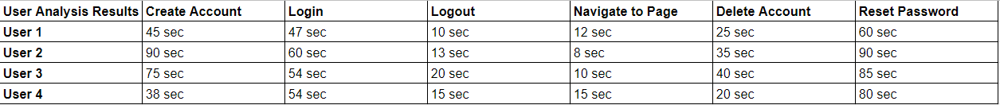

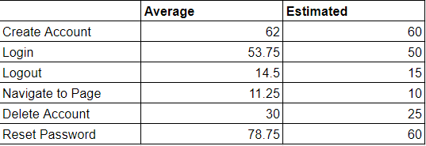

We tried to get a variety of users for this application. Two of the users were 20 - 25 year old male students with no technical background, and  limited technical skills. One user was a 20 - 25 year old female student with no technical background, with  limited technical skills. The final user was between the age of 40 - 60 with no technical background, with  very limited technical skills. This variety of users we felt was important as we tried to represent as many DCU students as possible. Also, these different groups of people would have different opinions and different outlooks which is also very important.

The way we calculated the estimated times for each task was for us to complete the task and add 20% to the result. When comparing our estimate times to the actual average times, results were largely similiar. However there was some variance in the reset password task, with it taking an average time of 78.75 seconds, whereas we believed it would take 60 seconds. This was slightly longer than we expected mainly becuase they had to check their email account to retrieve the code, with most users not realising this beforehand. These results show that the app is easy to use and gives us quantitative results.

[https://docs.google.com/forms/d/e/1FAIpQLSdnYkPovXmEVo77LTGgwIXDvIuRiDzQkjjMUB3y0hf34VFm4g/viewform?usp=sf_link](https://docs.google.com/forms/d/e/1FAIpQLSdnYkPovXmEVo77LTGgwIXDvIuRiDzQkjjMUB3y0hf34VFm4g/viewform?usp=sf_link)

We then asked them to fill out the survey above. The results for this were largely positive. All of the users thought the application was easy to use. Most users opinion on the design of the app was positive as well, however one user pointed out that the lines under the text inputs were unncessary. All of the users liked the colour scheme. All of the users understood the heat map page, some needed to read the text descriptions to understand it. Finally the users recommended that with the password text inputs should not automatically capitalize the first character. Also one user pointed out that highlighting the textual description for people would be good.

We have taken these ideas on board. We have changed the text inputs for the password so that they do not capitalize the first letter automatically. We experimented with the other ideas but we were unable to implement them due to time constraints. 

This user testing gave us a greater understanding of our users. It gave us different opinions on our application and gave us an opportunity to reflect on our design. If we were doing this again we might make a longer survey so that we could get a greater understanding of users, and test more users. This type of testing gave us both qualitative and quantitative results. We felt that this testing was a success, and now realise the importance of user testing in the software testing cycle. 

# **6. Heuristic Evaluation**
-----
For our heuristic evaluation we used Nielsen 10 principles for interaction design.

### Visibility of System Status ###
This means that the system must keep the users informed about what is happening and give appropriate feedback. Keeping users informed is vital as it allows users to perform their goal in the quickest amount of time possible. An example of how our application uses this principle is when a user is logging in. If the user enters the incorrect details they will be informed that their details are incorrect and will be asked to enter them again. This can be seen in the screenshot below. If they successfully login, they will transition to the menu page allowing them to choose a floor and see how occupied that floor is. 

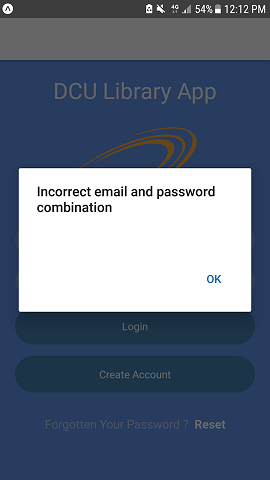

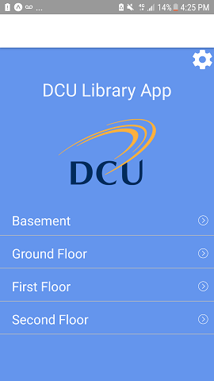

### Match Between System and the Real World ###

This means that a system should speak the users' language, and concepts familiar to the user, rather than system-oriented terms. A system should follow real-world conventions, making information appear in a natural and logical order. This is used throughout the application. The first instance we can see of this is in the login page. The information presented to the user is very clear and easy to understand. It is also in the language of the user in particular the option to reset the password. This principle is also followed in the menu page. The floors that you can choose are presented the way it is presented in the world, from the bottom floor up. Therefore it is clear that this principle is adhered to in the application.

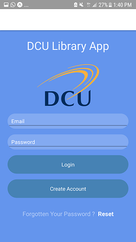

### User Control and Freedom ###

This means that a system must be able to support undo and redo functions as a user can make a mistake. This is vital as users often make mistakes and it must be easy for them to return to where they were previously. Our application follows this principle. This can be seen in many of the pages but in particular in any of the floor pages. When you select a floor it is very easy to transition back to the menu page. There is a back arrow or if you are on android you can use the back button either. This means that if a user wants to select the first floor but accidently selects the ground floor they can easily go back and select the correct floor. This same option can be seen on the settings page as well.

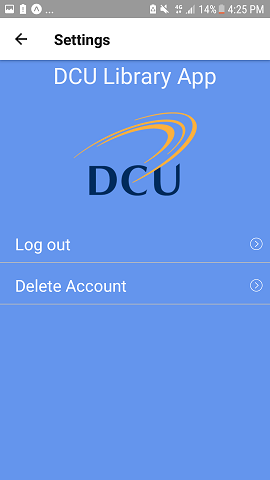

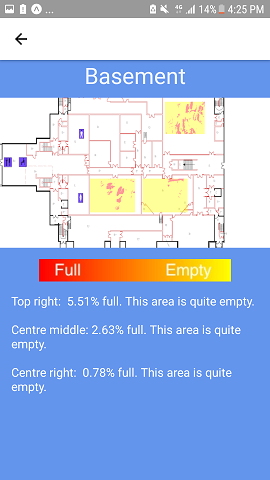

### Consistency and Standards ###

This means that users should not have to wonder whether different words, situations or actions mean the same thing. We stick to this principle in our application. Firstly the colour scheme is the same throughout the application. The same font is used right throughout the application as well. The same menu bar is displayed across every page. It is a white bar with a back button if appropriate. We use the same button throughout the application and the same text input area if the user must input something. The design of each page is largely the same to be consistent. The information within the application is standardised as well. Consistency is vital part of the application so that the user can quickly learn how to use the application.

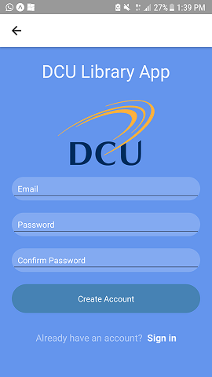

### Error Prevention ###

This is to stop a user from making an error. One should eliminate error-prone conditions or check for them and present users with a confirmation option before they commit to the action. This can be seen in the delete account option. When a user presses the delete account option in the settings menu, a pop up comes up asking them to confirm that they want to delete their account. This stops the user from possibly committing a big mistake. This is a very important part of the application as we want users not to make mistakes and use the application fully.

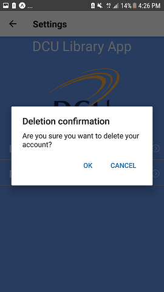

### Recognition Rather than Recall ###

This is to minimize the user's memory load, by making object action and options visible. Users should not have to remember information from one part to the next. This is a very important principle and one that we followed. Moving through the application is very easy as there are only a couple of options on each page. No page requires information from the previous one. As the design is consistent with buttons and inputs having the same format throughout the application, users are able to recognize quickly all of the options on the screen. This can be seen in the create account page and the login page where the text inputs and the buttons are the same.

### Flexibility and Effiency of Use ###

This refers to accelerators for the expert user. This is to allow an expert user to tailor frequent actions so that it speeds up the process for them. This is not an option in our application as the front end functionality is basic. As a user can only login, check a heatmap of a floor, logout, reset their password and delete their account, it is very hard for a user to speed up any of these processes. This principle was not relevant to our application due to this basic front-end functionality.

### Aesthetic and Minimalist Design ###

This means that only the relevant pieces of information should be displayed on any page. This principle was very important to us. You can see that on every single page only the necessary items are displayed. For example with the menu page only the four floors you can choose and the settings icon are displayed. Also in the login page only the options enter your login details, create a new account or reset your password are presented. This means that the user sees the most important information and can make an informed decision.

### Help Users Recognize, Diagnose, and Recover from Errors ###

This is to help users recover from their mistakes. This principle was very important for us. The first instance you can see this in our app is when a user enters incorrect details in the login page. A pop up saying that incorrect details were entered comes up. This lets the user recognize, diagnose and recover from this error and next time they can enter the correct details. The second instance of this is with the delete account option. If a user presses this option, a pop up appears making the user confirm if they want to complete this action. This means that if a user accidently presses this option they can recognize, diagnose their error and recover by pressing cancel. It is clear that our application follows this principle.

### Help and Documentation ###

We cover this principle by having a user manual. The user manual provides documentation on all of the aspects of the application and how to perform each task possible within the application.