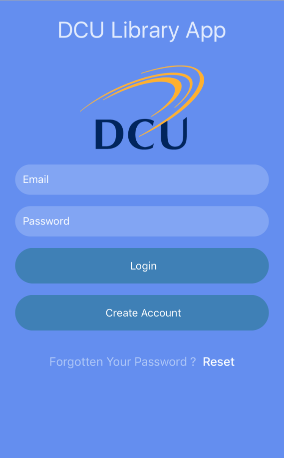
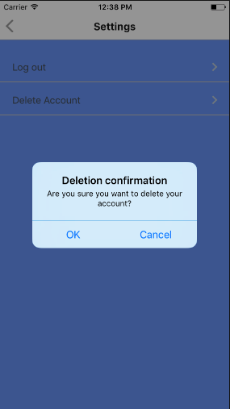

# User Manual #
-------
Edward Meade and Gavin McQuaid

------
# Table of Contents ##

- [**1. Introduction**](#--1-introduction--)
- [**2. Ethics**](#--2-ethics--)
- [**3. Installation**](#--3-installation)
- [**4. Creating an account**](#--4-creating-an-account)
- [**5. Log in**](#--5-login)
- [**6. Reading the map**](#--6-reading-the-map)
- [**7. Log out**](#--7-logout)
- [**8. Resetting your password**](#--8-resetting-your-password)
- [**9. Deleting your account**](#--9-deleting-your-account)

# **1. Introduction**
------

Anybody who has ever visited the DCU library knows that getting a seat is no easy task. During peak times the library is full to capacity and many students spend many minutes scouring the floors of the library in search of just one unoccupied seat. Often this search ends in disappointment. To add insult to injury the DCU library is located at the far end of the campus so anybody who doesn't find a seat has a tedious walk ahead to their next destination. 

The DCULibApp aims to solve this problem. Our app uses computer vision and machine learning to generate near real-time (accurate within a minute) heat maps of different areas of all the library floors. It generates a heat map detailing the occupancy level of an area as well as a textual description detailing the occupancy level of the area. This is done using footage from the CCTV camera that covers said area. In theory, any area in the library covered by a CCTV camera can be mapped.

Students simply sign up the application, log in and choose the floor they want to see the occupancy level of. No longer will students have to walk to the library to see how full or empty it actually is. Students can delete their account on the app at any time.

Note: this app is only a simulation due to privacy issues. We're simply proving that the idea would work if we had the footage. We used open-source video footage of an indoor area to replace footage of areas of the library.

-----
# **2. Ethics** #
With an application like this where sensitive information is used it is important to think about the privacy of users. Even though this app is a simulation using open-source data we need to look at how the data would be managed if a version with actual footage from DCU library were to be created. The idea would be that the app would be sold to DCU and managed by DCU security. We would seek to minimise the number of people handling the data. In terms of training, one of our algorithms uses background subtraction. What this means in practice is that the images used to train the algorithm would have no people in them. Once the algorithm is trained the data would longer need to be viewed by people. Once a image is processed by the app it can be immediately discarded so no data needs to be saved for more than two minutes. Our second algorithm which uses people detection would need training data with real people in it so ethical approval would need to be sought in this case.

Even though the non-training data images with people in them would only be handled by an algorithm a discussion would need to had about whether an app like this does more harm than good. 

----
# **3. Installation** #
The DCULibApp is avaible on both iOS and Android operating systems.

**iOS installation instructions**  
1. Click into the App Store  
2. Type DCULibApp into the search bar  
3. Download the App

**Android installation instructions**  
1. Click into the Play Store  
2. Type DCULibApp into the search bar  
3. Download the App

----
# **4. Creating an account** #
**Prerequisites for creating an account:**  
1. Must have either an Android phone or iPhone  
2. Must have a DCU email address

**Create an account process:**  
1. Click into the app.  
2. Tap Create Account button.      
       
           
3. Fill in DCU email address in email input section.   
4. Fill in password with at least 8 characters.  
5. Confirm chosen password.  
      
       
6. Tap create account button.  
      
      
7. You should see a success message and be brought back to the log in page if your account has been successfully created.

----

# **5. Log in** #
**Log in:**  
1. Click into the app.  
2. Fill in email and password.  
      
      
3. Tap log in button.   
4. If successful you should be logged in and see the menu page like below.  
      
           

**Log in for first time:**  
1. Follow steps 1-3 as above.  
2. You should see an authenticate code input field.   
     
      
3. Leave the app and go to your DCU email account.   
4. You should have an email from our Apache server with your authentication code in it. The code is 6 digits long.  
     
      
5. Go back to the app and type in the code.   
6. Tap authenticate account button.  
7. If successful you should be brought to the menu page.  
     
       
8. If unsuccessful hit generate new code button and repeat steps 3-6.

----

# **6. Reading the map** #
**Floor background subtraction:**  
  
  
  
At the top you can see the title which indicates which floor the floor plan belongs to. A yellow area on the floor plan image indicates an area covered by a CCTV camera. Red means that that part of the covered area is occupied. Below the floor plan there is the scale image which indicates these facts to the user. Each textual description on the screen corresponds to an area covered by a CCTV camera. 

**Floor people detection:**  
 
  
  
Again, at the top you can see the title which indicates which floor the floor plan belongs to. A yellow area on the floor plan image indicates an area covered by a CCTV camera. Every red dot on the screen is a person. Below the floor plan there is the scale image which indicates these facts to the user. Each textual description on the screen corresponds to an area covered by a CCTV camera.  

**Refreshing:**  
  
  
  
The heat maps and textual descriptions are updated every minute. To refresh them while in the floor page simply pull down on the screen with your finger and you should see the refresh in-progress spinner. The heat map and textual description should update. Alternatively, you can go back to the menu page and then into the floor screen again to update the heat map and textual description

  

----

# **7. Log out** #
**Log out:**  
1. Navigate to the menu page.  
     
      
2. Tap the settings button (cog icon).  
3. Tap log out button.   
     
     
4. You should be brought to the log in page. You are now logged out.

----

# **8. Resetting your password** #
**Resetting your password:**  
1. Click into the app.  
2. Tap the reset password link.  
     
       
3. Type in your DCU email address.  
4. Tap send reset email button.    
      
     
5. Leave the app and go to your DCU email account.  
6. You should have an email from our Apache server with your authentication code in it. The code is 6 digits long.    
      
    
7. Go back to the app and type in the code.  
      
      
8. Tap confirm code button.  
9. If successful you should be brought to the reset password page.If unsuccessful carry out steps 2-8 again.  
      
     
10. Type in new password that's at least eight characters long.  
11. Confirm password.  
12. Tap reset password button.  
13. If successful you'll be brought back to the login page.  
 

----

# **9. Deleting your account** #
**Deleting your account:**  
1. Tap into app.  
2. Log in.   
      
     
3. Tap the settings button (cog icon).  
      
      
4. Tap the delete account button.  
      
      
5. Tap OK when prompted to confirm.  
     
       
6. Your account is now deleted.  
      
      

----